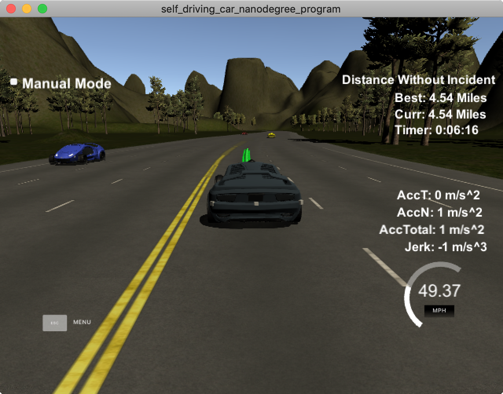

# Jay's CarND-Path-Planning-Project
Jay's Self-Driving Car Engineer Nanodegree Program
   
### Simulator.
You can download the Term3 Simulator which contains the Path Planning Project from the [releases tab (https://github.com/udacity/self-driving-car-sim/releases/tag/T3_v1.2).  

To run the simulator on Mac/Linux, first make the binary file executable with the following command:
```shell
sudo chmod u+x {simulator_file_name}
```

## Basic Build Instructions

1. Clone this repo.
2. Make a build directory: `mkdir build && cd build`
3. Compile: `cmake .. && make`
4. Run it: `./path_planning`.

Here is the data provided from the Simulator to the C++ Program

#### [More Instructions about project](https://github.com/udacity/CarND-Path-Planning-Project)

### problems resolved in project
1. thanks Aaron Brown, he already helps solved most problems
2. choose when to change lane, I add a function called `getBestLane()` to judge which lane
3. collision with front car, call `ref_vel -= .224;` twice if distance is too close.
4. collision with back when change lane, with `car_s - 20` to calc distance with front car in another lane.
    1. the car speed larger than the back car also be good, but not write in my code.

### distance without incident


### MORE READS
[Path Planning for Collision Avoidance Maneuver](https://www.researchgate.net/publication/267596342_Path_Planning_for_Collision_Avoidance_Maneuver)
[Research Article
Optimal Trajectory Planning for Glass-Handing Robot Based on Execution Time Acceleration and Jerk](https://www.hindawi.com/journals/jr/2016/9329131/)
[Which trajectory planning algorithm for minimizing jerk](https://robotics.stackexchange.com/questions/8555/which-trajectory-planning-algorithm-for-minimizing-jerk)